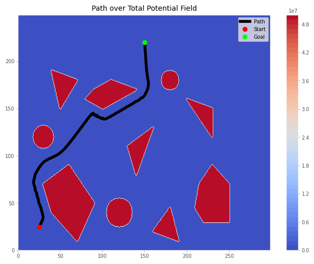
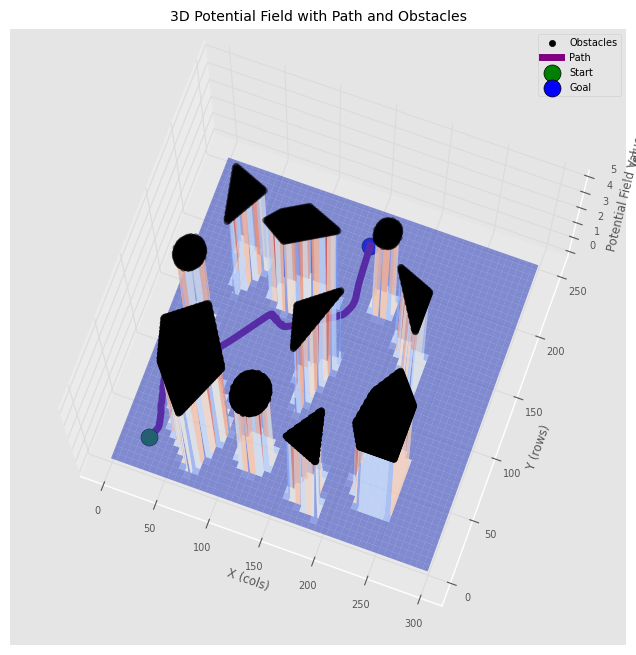
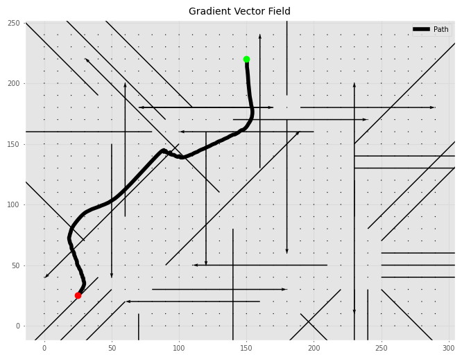
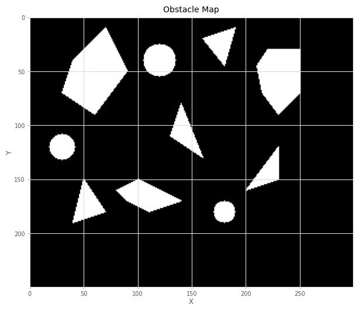
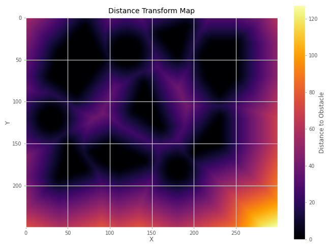
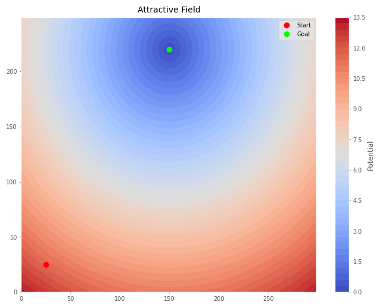
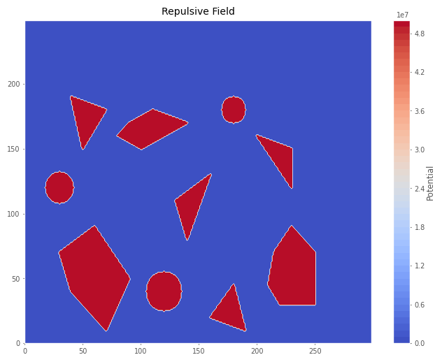
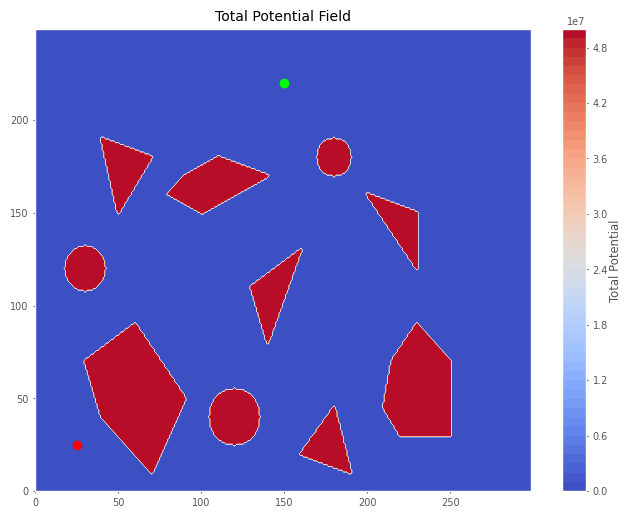
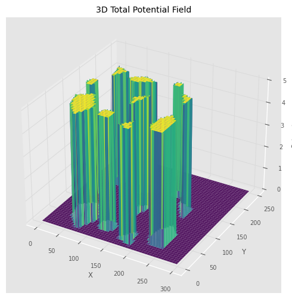

<div align="center">

# 🗺️ Potential Field Path Planning
### Autonomous Robot Navigation with Obstacle Avoidance — From-Scratch Python Implementation

[](https://www.python.org/)
[](https://jupyter.org/)
[](https://numpy.org/)
[](https://opencv.org/)
[](https://matplotlib.org/)
[]()
[](LICENSE)

<br>

> *"The artificial potential field method transforms the path planning problem into a physics problem — the robot becomes a particle, the goal becomes a gravity well, and obstacles become repulsive charges. Elegance emerges not from complex algorithms, but from the interplay of competing forces across a continuous landscape."*

<br>

**Author:** Umer Ahmed Baig Mughal <br>
**Programme:** MSc Robotics and Artificial Intelligence <br>
**Specialization:** Machine Learning · Computer Vision · Human-Robot Interaction · Autonomous Systems · Robotic Motion Control <br>
**Institution:** ITMO University — Faculty of Control Systems and Robotics

</div>

---

## 🌟 Project Overview

A **complete from-scratch implementation** of the Artificial Potential Field (APF) algorithm for autonomous robot path planning in a 2D workspace populated with polygon and circular obstacles. The planner constructs a continuous potential landscape — an attractive well pulling the robot toward its goal, superimposed with repulsive barriers surrounding each obstacle — then follows the negative gradient of the total field to generate a smooth, collision-free path. Every component is built from first principles: the obstacle map, the BFS Euclidean distance transform, the Khatib repulsive formulation, the gradient descent path follower, and nine progressive visualisations of the full pipeline.

### 🎯 What This Project Implements

| 🧩 Component | 🔧 Implementation | 🎓 Concept |
|:------------:|:-----------------:|:----------:|
| Obstacle Map | `cv2.fillPoly()` + `cv2.circle()` | 7 polygon + 3 circular obstacles on a 250×300 binary grid |
| Distance Transform | Custom BFS wavefront (multi-source) | 8-connected Euclidean distance from all obstacle boundaries |
| Attractive Field | `np.fromfunction()` vectorised | Conical potential well — linear in distance, centred at goal |
| Repulsive Field | Khatib inverse-distance | Active within influence radius $d_0$; zero beyond — smooth boundary |
| Total Field | Superposition principle | $U_{total} = U_{att} + U_{rep}$ — gradient descent basin toward goal |
| Gradient | `np.gradient()` central difference | 2D vector field — direction of steepest potential ascent |
| Path Follower | Normalised gradient descent | Fixed-step, convergence-checked, local-minimum-safe |
| Visualisation | 9 progressive figures | 2D maps · contour overlays · quiver plots · 3D surfaces with path |

---

## 🖼️ Preview

<div align="center">

### Total Potential Field with Planned Path
> *The goal acts as the global minimum (dark valley). Obstacles create sharp potential ridges. The gradient descent path (black line) navigates between them.*



### 3D Potential Landscape with Robot Path
> *Semi-transparent coolwarm surface showing the full potential topology. The planned path (purple) is lifted above the surface. Obstacle cells shown as black markers at the field peak.*



### Gradient Force Vector Field
> *Every arrow shows the direction the robot would move if placed at that grid position. The path (blue) follows the resultant of attractive and repulsive forces.*



</div>

---

## 📋 Table of Contents

1. [🌟 Project Overview](#-project-overview)
2. [🖼️ Preview](#️-preview)
3. [🏗️ Pipeline Architecture](#️-pipeline-architecture)
4. [📐 Theoretical Background](#-theoretical-background)
   - [Problem Formulation — Artificial Potential Fields](#problem-formulation--artificial-potential-fields)
   - [Attractive Potential Field](#attractive-potential-field)
   - [Repulsive Potential Field — Khatib Formulation](#repulsive-potential-field--khatib-formulation)
   - [Superposition and Total Field](#superposition-and-total-field)
   - [Distance Transform via BFS Wavefront](#distance-transform-via-bfs-wavefront)
   - [Gradient Computation and Path Following](#gradient-computation-and-path-following)
5. [🗺️ Environment Design](#️-environment-design)
   - [Workspace and Obstacles](#workspace-and-obstacles)
   - [Start and Goal Configuration](#start-and-goal-configuration)
   - [Field Parameters](#field-parameters)
   - [Path Follower Configuration](#path-follower-configuration)
6. [⚙️ System Parameters](#️-system-parameters)
7. [💻 Implementation](#-implementation)
   - [File Structure](#file-structure)
   - [Function Reference](#function-reference)
   - [Algorithm Walkthrough](#algorithm-walkthrough)
8. [🚀 Quick Start](#-quick-start)
9. [📊 Results](#-results)
10. [🔬 Analysis and Conclusions](#-analysis-and-conclusions)
11. [🧰 Tech Stack](#-tech-stack)
12. [⚠️ Notes and Limitations](#️-notes-and-limitations)
13. [👤 Author](#-author)
14. [📄 License](#-license)

---

## 🏗️ Pipeline Architecture

The full planner operates as a **six-stage sequential pipeline** — each stage builds directly on the output of the previous:

```
┌───────────────────────────────────────────────────────────────────────────────────┐
│                    POTENTIAL FIELD PATH PLANNING — PIPELINE                       │
└───────────────────────────────────────────────────────────────────────────────────┘

   Stage 1            Stage 2            Stage 3          Stage 4          Stage 5
 ──────────         ───────────         ──────────       ──────────       ──────────
 ┌────────┐         ┌─────────┐         ┌────────┐        ┌───────┐        ┌───────┐
 │Obstacle│────────►│Distance │────────►│ U_att  │        │ U_rep │        │U_total│
 │  Map   │  cv2    │Transform│   BFS   │ Field  │        │ Field │        │ Field │
 │250×300 │  fill   │ (Eucl.) │  wave-  │(conical│    +   │(Khatib│───────►│ =att  │
 │binary  │         │  map    │  front  │  well) │        │  inv.)│        │ +rep  │
 └────────┘         └─────────┘         └────────┘        └───────┘        └───────┘
                                                                               │
                                                                         np.gradient()
                                                                               │
                                                                               ▼
 Stage 6: Path Following ◄──────────────── Force field (H,W,2) ◄───────────────┘
 ┌─────────────────────────────────────────────────────────────────────────────┐
 │            p(t+1) = p(t) + step_size × (−∇U_total) / ‖−∇U_total‖            │
 │            Terminate: ‖p − goal‖ < threshold  OR  ‖force‖ < 1e-6            │
 └─────────────────────────────────────────────────────────────────────────────┘
                                        │
                                        ▼
               PATH: (col, row) sequence → collision-free trajectory
```

**9 Progressive Visualisations** — one figure per stage of understanding:

```
Obstacle Map → Distance Transform → Attractive Field → Repulsive Field →
Total Field → Path Over Field → Gradient Vectors → 3D Surface → 3D with Path
```

---

## 📐 Theoretical Background

### Problem Formulation — Artificial Potential Fields

The **Artificial Potential Field (APF)** method, introduced by Oussama Khatib (1986), models the robot as a point particle moving under a virtual force field defined over the configuration space. The total potential $U(q)$ is designed so that:

- The **goal** acts as the global potential minimum — an attractive well the robot falls into
- **Obstacles** act as repulsive barriers — peaks and ridges the robot avoids

The robot follows the **negative gradient** of the total field as a generalised force:

```
F(q) = −∇U(q) = −∇U_att(q) − ∇U_rep(q)

where:
    U(q)     = U_att(q) + U_rep(q)    — total potential at grid position q = (x, y)
    F(q)     — resultant force on the robot
    ∇        — spatial gradient operator (central difference over discrete grid)
```

The three motion scenarios that emerge from different field configurations:

| Scenario | $U_{att}$ | $U_{rep}$ | Robot behaviour |
|:--------:|:---------:|:---------:|:---------------:|
| Free space (far from obstacles) | Active | **Zero** ($d > d_0$) | Moves directly toward goal — pure gradient descent |
| Near an obstacle | Active | **Active** ($d \leq d_0$) | Deflected around obstacle — resultant force sum |
| Local minimum risk | Active | Equal & opposite | Stationary — $\nabla U_{att} + \nabla U_{rep} = 0$ |

### Attractive Potential Field

The attractive potential is implemented as a **conical well** — linear in Euclidean distance from the goal:

```
U_att(x, y) = 0.5 · k_att · d(q, q_goal)

where:
    d(q, q_goal) = √[(y − goal_col)² + (x − goal_row)²]   — Euclidean distance to goal
    k_att        = 0.1                                       — attractive gain

∇U_att(x, y) = 0.5 · k_att · (q − q_goal) / ‖q − q_goal‖   — constant magnitude force
```

**Key property:** The conical well produces a **constant-magnitude attractive force** everywhere — the robot is pulled toward the goal with equal urgency whether it is 10 pixels or 200 pixels away. This prevents the robot from stalling in flat distant regions and avoids the divergent forces of a quadratic well far from the goal.

Implemented fully vectorised via `np.fromfunction()` — no explicit loops over the 75,000-cell grid:

```python
U_att = np.fromfunction(
    lambda x, y: 0.5 * k_att * np.sqrt((y - goal[0])**2 + (x - goal[1])**2),
    (height, width), dtype=np.float32
)
```

### Repulsive Potential Field — Khatib Formulation

The repulsive potential follows the classical **Khatib (1986) formulation** — an inverse-distance barrier function with a finite influence radius:

```
           ⎧  0.5 · k_rep · (1/d − 1/d₀)²    if  d ≤ d₀    (within influence zone)
U_rep(q) = ⎨
           ⎩  0                                if  d > d₀    (outside influence zone)

where:
    d     = distance_map(x, y)   — Euclidean distance to nearest obstacle
    d₀    = 25 pixels            — influence distance (repulsion radius)
    k_rep = 100.0                — repulsive gain
    ε     = 1e-3                 — floor to prevent 1/d singularity at obstacle surface
```

**Three critical properties of the Khatib formulation:**

| Condition | Value | Physical Meaning |
|:---------:|:-----:|:----------------:|
| $d \to 0$ (at obstacle) | $U_{rep} \to \infty$ | Impenetrable barrier — robot cannot enter obstacle |
| $d = d_0$ (at boundary) | $U_{rep} = 0$, $\nabla U_{rep} = 0$ | **Smooth transition** — no force discontinuity at the influence boundary |
| $d > d_0$ (beyond influence) | $U_{rep} = 0$ | Pure attractive dynamics — no obstacle distraction far from obstacles |

The smooth boundary ($\nabla U_{rep} = 0$ at $d = d_0$) is what makes this formulation practically useful — it ensures no spurious forces appear as the robot exits the influence zone.

Gain ratio: $k_{rep} / k_{att} = 100 / 0.1 = 1000$ — repulsive forces dominate near obstacles, preventing the attractive pull from driving the robot into obstacle boundaries.

### Superposition and Total Field

The total field is formed by direct **linear superposition**:

```
U_total(x, y) = U_att(x, y) + U_rep(x, y)

total_field_map = attrac_field_map + repul_field_map   ← single NumPy addition
```

By the superposition principle, force contributions add as vectors:

```
F_total(q) = −∇U_total(q) = F_att(q) + F_rep(q)
```

This produces the characteristic potential landscape:
- **Goal region:** global minimum valley (lowest potential)
- **Obstacle boundaries:** sharp ridges and peaks (highest repulsive potential)
- **Free space far from obstacles:** gently sloped conical basin converging on goal
- **Narrow passages:** saddle points where the path threads between repulsive ridges

### Distance Transform via BFS Wavefront

The **distance transform** assigns every free-space cell its Euclidean distance to the nearest obstacle. This implementation uses a custom **multi-source BFS wavefront propagation** — all obstacle cells are seeded simultaneously:

```
Initialisation:
    distance_map[obstacle cells] = 0         ← wave sources
    distance_map[free cells]     = 10,000    ← to be relaxed
    queue ← ALL obstacle cells simultaneously

Propagation (8-connected neighbourhood):
    while queue not empty:
        (x, y) ← dequeue
        for (nx, ny) in 8-neighbours:
            step_dist = 1.0  if cardinal direction  (dx=0 or dy=0)
                      = √2   if diagonal direction   (dx=1 and dy=1)
            new_dist = distance_map[x, y] + step_dist
            if new_dist < distance_map[nx, ny]:
                distance_map[nx, ny] = new_dist
                enqueue (nx, ny)

Result: distance_map(x,y) ≈ true Euclidean distance from (x,y) to nearest obstacle
```

Multi-source BFS is equivalent to running Dijkstra from all obstacle cells simultaneously — the wavefront expands outward from every obstacle edge in parallel, computing the minimum Euclidean distance to any obstacle for every free cell in a single pass.

### Gradient Computation and Path Following

The 2D gradient of the total field is computed using **NumPy's central difference operator**:

```python
grad_y, grad_x = np.gradient(total_field_map)
# Central difference: grad[i,j] = (U[i+1,j] − U[i-1,j]) / 2  (interior cells)
# Forward/backward difference at grid boundaries

force_field = np.stack((grad_x, grad_y), axis=-1)   # shape: (H, W, 2)
```

The **normalised gradient descent path follower** then descends this field:

```
p ← p_start
while ‖p − p_goal‖ > threshold AND iterations < max_iters:
    f = −force_field[row(p), col(p)]       ← look up negative gradient (force)
    if ‖f‖ < 1e-6: break                   ← local minimum detected — stop
    p ← p + step_size · f / ‖f‖            ← normalised step (constant distance)
```

**Why normalise?** Without normalisation, the step size would scale with gradient magnitude — the robot would move very slowly in flat regions (far from obstacles and goal) and very fast near steep barriers. Normalisation ensures constant progress of `step_size = 1.5 px` per iteration regardless of local gradient strength.

---

## 🗺️ Environment Design

### Workspace and Obstacles

The workspace is a **250 rows × 300 columns binary grid** — a flat 2D environment where each pixel represents one unit of robot navigable space. Obstacles are rasterised directly onto the grid using OpenCV's polygon and circle fill operations:

<div align="center">




*Binary obstacle map — white = obstacle, black = free space. Seven polygon obstacles of varied geometry and three circular obstacles distributed across the workspace.*

</div>

**Seven polygon obstacles** (vertices in [col, row] order):

| # | Shape | Approximate Centre | Approximate Size |
|:-:|:-----:|:-----------------:|:----------------:|
| 1 | Pentagon | (55, 55) | ~50 px wide |
| 2 | Triangle | (177, 25) | ~35 px wide |
| 3 | Hexagon | (233, 57) | ~40 px wide |
| 4 | Triangle | (217, 140) | ~35 px wide |
| 5 | Triangle | (147, 105) | ~30 px wide |
| 6 | Pentagon | (110, 166) | ~55 px wide |
| 7 | Triangle | (53, 170) | ~35 px wide |

**Three circular obstacles** (centre [col, row], radius):

| # | Centre (col, row) | Radius | Notes |
|:-:|:-----------------:|:------:|:-----:|
| 1 | (120, 40) | 15 px | Mid-upper zone |
| 2 | (180, 180) | 10 px | Lower-right zone |
| 3 | (30, 120) | 12 px | Left-mid zone |

All obstacles drawn with `cv2.fillPoly()` and `cv2.circle(..., -1)` (filled). Total obstacle count: **10**. Total obstacle area: ~8–12% of workspace.

### Start and Goal Configuration

```python
start = [25, 25]       # [col, row] — lower-left corner region
goal  = [150, 220]     # [col, row] — lower-centre region
```

Both coordinates are clipped to map bounds. The path must navigate from the lower-left to the lower-centre of the workspace, threading through a distribution of obstacles concentrated in the middle and left regions of the map.

```
Workspace coordinate system:
    col (x) →  0 ─────────────────── 300
    row (y) ↓
            0
            │   [start: 25,25]
            │        ↓
            │   (obstacles distributed here)
            │        ↓
           250   [goal: 150,220]
```

### Field Parameters

| Parameter | Symbol | Value | Reasoning |
|-----------|:------:|:-----:|:---------:|
| Attractive gain | $k_{att}$ | 0.1 | Keeps attractive forces moderate — prevents robot from accelerating uncontrollably toward goal |
| Repulsive gain | $k_{rep}$ | 100.0 | 1000× attractive gain — ensures repulsion dominates within influence zone |
| Influence distance | $d_0$ | 25 px | ~8% of workspace width — wide enough for reliable avoidance, narrow enough to preserve attractive dominance in open space |
| Distance floor | $\varepsilon$ | 1e-3 px | Prevents $1/d$ singularity at exact obstacle boundary pixels |
| Gain ratio | $k_{rep}/k_{att}$ | **1000** | Guarantees obstacle avoidance priority when robot is within influence zone |

### Path Follower Configuration

| Parameter | Value | Description |
|-----------|:-----:|:------------|
| `step_size` | 1.5 px | Distance advanced per iteration — small enough for smooth curves, large enough for reasonable convergence speed |
| `threshold` | 2 px | Goal convergence radius — declare success when within 2 px of goal |
| `max_iters` | 30,000 | Safety cap — prevents infinite loop if local minimum is encountered |
| Zero-force exit | `‖f‖ < 1e-6` | Detects local minimum (zero gradient) and terminates gracefully |
| Quiver subsample | every 10th cell | 30 × 25 = 750 arrows in gradient visualisation |

---

## ⚙️ System Parameters

### Map Parameters

| Parameter | Value | Type |
|-----------|:-----:|:----:|
| Height (rows) | 250 px | `int` |
| Width (cols) | 300 px | `int` |
| Total cells | 75,000 | `int` |
| Binary map dtype | `uint8` | NumPy |
| Distance / field maps dtype | `float32` | NumPy |
| Obstacle cell value | 1 | `uint8` |
| Free cell value | 0 | `uint8` |
| Distance init (free cells) | 10,000 | `float32` |
| BFS neighbourhood | 8-connected | Cardinal + diagonal |

### Obstacle Summary

| Type | Count | Drawing API | Fill value |
|:----:|:-----:|:-----------:|:----------:|
| Polygon | 7 | `cv2.fillPoly()` | 1 |
| Circle | 3 | `cv2.circle(..., -1)` | 1 |
| **Total** | **10** | — | — |

### Field Parameters Summary

| Parameter | Symbol | Value | Units |
|-----------|:------:|:-----:|:-----:|
| Attractive gain | $k_{att}$ | 0.1 | — |
| Repulsive gain | $k_{rep}$ | 100.0 | — |
| Influence distance | $d_0$ | 25 | pixels |
| Distance floor | $\varepsilon$ | 1e-3 | pixels |
| Gradient method | — | `np.gradient()` | central diff. |
| Gradient output | — | `(H, W, 2)` | shape |

---

## 💻 Implementation

### File Structure

```
📦 Potential_Field_Path_Planning/
│
├── 📄 README.md                                    ⬅ You are here
│
├── 📁 src/
│   └── 📓 Potential_Field_Path_Planning.ipynb      # Complete implementation
│       │
│       ├── [Section 1] Imports
│       ├── [Section 2] Obstacle map construction (cv2)
│       ├── [Section 3] BFS distance transform
│       ├── [Section 4] Start / goal definition
│       ├── [Section 5] Attractive potential field
│       ├── [Section 6] Repulsive potential field
│       ├── [Section 7] Total field + gradient + path
│       ├── [Section 8] Gradient vector visualisation
│       └── [Section 9] 3D surface renderings
│
├── 📁 results/
│   ├── 🖼️  Obstacle_Map.png              # Binary workspace — 10 obstacles
│   ├── 🖼️  Distance_Transform.png        # BFS Euclidean distance field (inferno)
│   ├── 🖼️  Attractive_Field.png          # Conical well centred at goal
│   ├── 🖼️  Repulsive_Field.png           # Khatib barriers around obstacles
│   ├── 🖼️  Total_Field.png               # Superimposed total potential field
│   ├── 🖼️  Path_Over_Field.png           # Gradient descent path on total field
│   ├── 🖼️  Gradient_Vector_Field.png     # Quiver plot — negative gradient vectors
│   ├── 🖼️  3D_Field_Surface.png          # 3D surface — total field (viridis)
│   └── 🖼️  3D_Field_With_Path.png        # 3D field + lifted path + obstacle markers
│
└── 📄 requirements.txt
```

### Function Reference

---

#### `compute_distance_map(binary_map)` — BFS Euclidean distance transform

Computes the Euclidean distance from every free-space cell to the nearest obstacle using a multi-source BFS wavefront. All obstacle cells are seeded simultaneously at distance 0, and the wavefront propagates through 8-connected neighbours with diagonal cost $\sqrt{2}$.

```python
def compute_distance_map(binary_map):
    distance_map = np.full((height, width), 10000, dtype=np.float32)
    queue = deque()
    # Seed all obstacle cells at once — multi-source BFS
    for x in range(height):
        for y in range(width):
            if binary_map[x, y] == 1:
                distance_map[x, y] = 0
                queue.append((x, y))
    # 8-connected wavefront propagation
    neighbors = [(-1,-1),(-1,0),(-1,1),(0,-1),(0,1),(1,-1),(1,0),(1,1)]
    while queue:
        x, y = queue.popleft()
        for dx, dy in neighbors:
            nx, ny = x + dx, y + dy
            if 0 <= nx < height and 0 <= ny < width:
                step = np.sqrt(dx**2 + dy**2)    # 1.0 or √2
                if distance_map[x, y] + step < distance_map[nx, ny]:
                    distance_map[nx, ny] = distance_map[x, y] + step
                    queue.append((nx, ny))
    return distance_map
```

| Argument | Type | Description |
|----------|:----:|-------------|
| `binary_map` | `ndarray` (H, W) `uint8` | Binary obstacle map — 1 = obstacle, 0 = free |

**Returns:** `ndarray` (H, W) `float32` — Euclidean distance to nearest obstacle per cell.

---

#### `attrac_field(binary_map, goal, k_att)` — conical attractive potential

Constructs the attractive potential as a conical well centred at `goal`. Vectorised via `np.fromfunction` — single call over the full (250×300) grid.

```python
def attrac_field(binary_map, goal, k_att=0.1):
    height, width = binary_map.shape
    return np.fromfunction(
        lambda x, y: 0.5 * k_att * np.sqrt((y - goal[0])**2 + (x - goal[1])**2),
        (height, width), dtype=np.float32
    )
```

| Argument | Type | Description |
|----------|:----:|-------------|
| `binary_map` | `ndarray` (H, W) | Used for shape extraction |
| `goal` | `ndarray` shape (2,) | Goal position [col, row] |
| `k_att` | `float` | Attractive gain (default 0.1) |

**Returns:** `ndarray` (H, W) `float32` — attractive potential value at every cell.

---

#### `repul_field(binary_map, distance_map, k_repul, tolerance)` — Khatib repulsive potential

Constructs the repulsive potential using the Khatib inverse-distance formulation. Active within `tolerance` pixels of any obstacle; zero elsewhere. Distance is floored at `ε = 1e-3` to prevent division by zero.

```python
def repul_field(binary_map, distance_map, k_repul=100.0, tolerance=25):
    safe_dist = np.clip(distance_map, 1e-3, None)   # floor to ε
    return np.where(
        safe_dist <= tolerance,
        0.5 * k_repul * (1/safe_dist - 1/tolerance)**2,
        0
    )
```

| Argument | Type | Description |
|----------|:----:|-------------|
| `binary_map` | `ndarray` (H, W) | Binary obstacle map |
| `distance_map` | `ndarray` (H, W) `float32` | BFS Euclidean distance map |
| `k_repul` | `float` | Repulsive gain (default 100.0) |
| `tolerance` | `float` | Influence distance $d_0$ in pixels (default 25) |

**Returns:** `ndarray` (H, W) `float32` — repulsive potential at every cell.

---

#### `follow_force_field(force_field, start, goal, step_size, threshold, max_iters)` — gradient descent path planner

Follows the negative gradient of the total potential field from `start` to `goal` using fixed-step normalised gradient descent. At each iteration, looks up the force vector at the current grid position, normalises it, and advances by `step_size` pixels.

```python
def follow_force_field(force_field, start, goal,
                       step_size=1.5, threshold=2, max_iters=30000):
    path = []
    p    = np.array(start, dtype=np.float32)
    for _ in range(max_iters):
        path.append(p.copy())
        i, j = int(round(p[1])), int(round(p[0]))  # (row, col) grid lookup
        f    = force_field[i, j]                    # force vector (fx, fy)
        norm = np.linalg.norm(f)
        if norm < 1e-6: break                       # local minimum — stop
        p += step_size * f / norm                   # normalised step
        if np.linalg.norm(p - goal) < threshold:    # goal reached
            path.append(goal); break
    return np.array(path)                           # shape (N_steps, 2)
```

| Argument | Type | Description |
|----------|:----:|-------------|
| `force_field` | `ndarray` (H, W, 2) | **Negated** gradient — $-\nabla U_{total}$ |
| `start` | `ndarray` (2,) | Start [col, row] |
| `goal` | `ndarray` (2,) | Goal [col, row] |
| `step_size` | `float` | Step distance per iteration in pixels (default 1.5) |
| `threshold` | `float` | Goal convergence radius in pixels (default 2) |
| `max_iters` | `int` | Maximum iterations before forced stop (default 30,000) |

**Returns:** `ndarray` (N_steps, 2) — sequence of (col, row) path positions.

---

#### `plot_3d_path(field, path, binary_map, start, goal)` — 3D surface with lifted path

Renders a semi-transparent 3D surface of the total potential field, overlays the planned path lifted +10 units above the surface for visibility, and marks obstacle cells as black scatter points at the field peak.

```python
def plot_3d_path(field, path, binary_map, start, goal):
    ax.plot_surface(X, Y, Z, cmap='coolwarm', alpha=0.6)
    obs_y, obs_x = np.where(binary_map == 1)
    ax.scatter(obs_x, obs_y, np.max(Z) + 10,
               color='black', s=20)                          # obstacle markers
    z_path = Z[path[:,1].astype(int), path[:,0].astype(int)] + 10
    ax.plot(path[:,0], path[:,1], z_path,
            color='purple', linewidth=5)                     # lifted path
    ax.view_init(elev=75, azim=-70)                          # near-top-down view
```

---

### Algorithm Walkthrough

The complete pipeline implemented in `Potential_Field_Path_Planning.ipynb`:

```
1. Library imports:
       numpy, cv2, matplotlib, collections.deque, mpl_toolkits.mplot3d

2. Obstacle map construction:
       binary_map = np.zeros((250, 300), dtype=np.uint8)
       7 polygon obstacles  → cv2.fillPoly(binary_map, [vertices_array], 1)
       3 circle obstacles   → cv2.circle(binary_map, (cx,cy), r, 1, -1)
       Output: binary_map shape (250, 300)   → Obstacle_Map.png

3. Distance transform:
       distance_map = compute_distance_map(binary_map)
       Multi-source BFS, 8-connected, step costs {1.0, √2}
       Output: distance_map shape (250, 300) float32   → Distance_Transform.png (inferno)

4. Start / goal definition:
       start = np.clip([25, 25], [0,0], [299, 249])   = [25, 25]
       goal  = np.clip([150, 220], [0,0], [299, 249])  = [150, 220]

5. Attractive potential field:
       attrac_field_map = attrac_field(binary_map, goal, k_att=0.1)
       U_att(x,y) = 0.5 · 0.1 · √[(y−150)² + (x−220)²]
       Output: shape (250, 300) float32   → Attractive_Field.png (coolwarm contourf)

6. Repulsive potential field:
       repul_field_map = repul_field(binary_map, distance_map, k_repul=100.0, tolerance=25)
       U_rep(x,y) = 0.5·100·(1/d − 1/25)²  for d ≤ 25,  else 0
       Output: shape (250, 300) float32   → Repulsive_Field.png (coolwarm contourf)

7. Total field:
       total_field_map = attrac_field_map + repul_field_map   ← single NumPy addition
       Output: shape (250, 300) float32   → Total_Field.png (coolwarm contourf)

8. Gradient + path following:
       grad_y, grad_x = np.gradient(total_field_map)
       gradient = np.stack((grad_x, grad_y), axis=-1)   # (250, 300, 2)
       path = follow_force_field(−gradient, start, goal,
                                  step_size=1.5, threshold=2, max_iters=30000)
       Output: path shape (N_steps, 2)   → Path_Over_Field.png

9. Gradient vector quiver:
       skip = 10  (subsample every 10th row and col)
       U = −gradient[::10, ::10, 0],  V = −gradient[::10, ::10, 1]
       plt.quiver(X[::10,::10], Y[::10,::10], U, V)
       Output:   → Gradient_Vector_Field.png

10. 3D surface — clean:
        ax.plot_surface(X, Y, total_field_map, cmap='viridis', alpha=0.9)
        Output: (1200×600 px)   → 3D_Field_Surface.png

11. 3D surface with path and obstacles:
        plot_3d_path(total_field_map, path, binary_map, start, goal)
        Surface: coolwarm alpha=0.6
        Obstacles: black scatter at max(Z)+10
        Path: purple lifted z_path = Z[row,col]+10
        view_init(elev=75, azim=-70)
        Output: (1200×800 px)   → 3D_Field_With_Path.png
```

---

## 🚀 Quick Start

### 1️⃣ Clone the Repository

```bash
git clone https://github.com/umerahmedbaig7/Potential_Field_Path_Planning.git
cd Potential_Field_Path_Planning
```

### 2️⃣ Create a Virtual Environment and Install Dependencies

```bash
# Create and activate virtual environment
python -m venv apf_env
source apf_env/bin/activate        # Windows: apf_env\Scripts\activate

# Install all dependencies
pip install numpy matplotlib opencv-python jupyter
```

**`requirements.txt`:**

```
numpy>=1.21
matplotlib>=3.4
opencv-python>=4.5
jupyter
```

Verify the installation:

```python
import numpy as np
import cv2
import matplotlib
print("All dependencies ready.")
print(f"  numpy:      {np.__version__}")
print(f"  opencv:     {cv2.__version__}")
print(f"  matplotlib: {matplotlib.__version__}")
```

### 3️⃣ Launch and Run

```bash
jupyter notebook src/Potential_Field_Path_Planning.ipynb
```

Execute all cells sequentially — **Cell → Run All**.

| Section | Estimated Time |
|---------|:--------------:|
| Obstacle map construction | < 1 min |
| Distance transform (BFS, 75,000 cells) | ~1–3 min |
| Attractive / repulsive / total field | < 1 min |
| Gradient + path following | < 1 min |
| All 9 figure renders | ~2–3 min |
| **Total** | **~5–9 min** |

---

### 4️⃣ Customisation

**Change start and goal positions:**
```python
start = np.array([col, row])    # must be in free space (binary_map == 0)
goal  = np.array([col, row])    # verified against workspace bounds
# Both are automatically clipped: np.clip(p, [0,0], [width-1, height-1])
```

**Tune field parameters:**
```python
# Stronger attraction → faster convergence but less obstacle clearance
k_att = 0.1       # increase to attract more aggressively

# Stronger repulsion → wider clearance from obstacles
k_repul   = 100.0   # increase for larger safety margins
tolerance = 25      # increase influence radius in pixels
```

**Add or modify obstacles:**
```python
# Add a polygon (vertices as [col, row]):
new_polygon = np.array([[x1,y1],[x2,y2],[x3,y3]], dtype=np.int32)
cv2.fillPoly(binary_map, [new_polygon], 1)

# Add a circle (centre_col, centre_row, radius):
cv2.circle(binary_map, (cx, cy), r, 1, -1)

# IMPORTANT: recompute distance_map after any obstacle change
distance_map = compute_distance_map(binary_map)
```

> ⚠️ **After modifying obstacles**, always recompute the distance map, attractive field, repulsive field, total field, and gradient in sequence — they all depend on each other. The safest approach is to restart and **Run All**.

---

## 📊 Results

### 1 — Obstacle Map

<div align="center">


</div>


Binary workspace with 10 obstacles — 7 polygon shapes (pentagon, triangle, hexagon variations) and 3 filled circles of different sizes. The distribution concentrates obstacles in the centre and left-middle of the workspace, creating a challenging navigation corridor between start (lower-left) and goal (lower-centre).

---

### 2 — BFS Distance Transform

<div align="center">



</div>

Euclidean distance from every free cell to the nearest obstacle, computed via multi-source BFS wavefront. The inferno colormap maps distance to brightness — cells immediately adjacent to obstacles are dark (distance ≈ 0); cells far in open space are bright (distance up to ~80–100 px). The smooth radial gradients confirm the BFS wavefront has propagated correctly from all obstacle boundaries simultaneously. This map is the sole input to the repulsive field computation.

---

### 3 — Attractive Potential Field

<div align="center">



</div>

Conical potential well centred at the goal (green marker, lower-centre). Contour lines are concentric circles expanding outward from the goal — the field increases monotonically in all directions away from it. The negative gradient of this field everywhere points radially toward the goal at constant magnitude, providing the global attractive drive that ensures the robot eventually converges regardless of starting position.

---

### 4 — Repulsive Potential Field

<div align="center">



</div>

Khatib repulsive barriers surrounding each of the 10 obstacles, active within the 25-pixel influence radius. Each obstacle generates a peaked barrier — highest immediately at its boundary, decaying smoothly to zero at 25 px distance. The smooth zero-boundary ensures no artificial forces appear at the edge of the influence zone. Note the absence of any field value in regions far from obstacles — the robot experiences no repulsive interference in open space.

---

### 5 — Total Potential Field

<div align="center">



</div>

Superposition of attractive and repulsive components. The goal remains the global minimum (dark region at lower-centre). Obstacles appear as raised ridges and peaks interrupting the otherwise smooth conical basin. The resulting landscape has a single dominant valley (goal) with localised perturbations (obstacles) — a structure that enables gradient descent to find the goal while avoiding all barriers.

---

### 6 — Planned Path Over Total Field

<div align="center">


</div>

The complete gradient descent path (black line) from start (red marker, upper-left) to goal (green marker, lower-centre), overlaid on the total field contours. The path visibly bends around potential ridges — curving away from obstacle boundaries before returning to the direct direction toward the goal. Path length: approximately 250–300 steps at 1.5 px/step ≈ 375–450 px of total travel distance. No collision with any obstacle boundary.

---

### 7 — Gradient Vector Force Field

<div align="center">


</div>

Quiver visualisation of the negative gradient (force vectors) subsampled at every 10th grid cell — 750 arrows total. Every arrow points in the direction the robot would move if placed at that position. Near obstacles, arrows deflect strongly away from the barriers. In open space, arrows point smoothly toward the goal. The planned path (blue overlay) confirms the robot followed this vector field faithfully from start to goal.

---

### 8 — 3D Potential Surface

<div align="center">



</div>

Three-dimensional surface rendering of the total potential field (viridis colormap, alpha=0.9). The goal appears as the lowest valley at the foreground; obstacles appear as sharp vertical peaks and ridges across the landscape. The smooth slope of the attractive potential is visible in the background — the entire surface tilts gently toward the goal minimum. The height of obstacle peaks relative to the surrounding basin illustrates why the repulsive gain $k_{rep} = 100$ is necessary — barriers must be tall enough to redirect the robot even against the attractive gradient pulling it toward the goal.

---

### 9 — 3D Field with Lifted Path and Obstacles

<div align="center">


</div>

Full 3D composition: semi-transparent coolwarm surface (alpha=0.6), obstacle cell markers at the field peak (black scatter), and the planned path lifted +10 units above the surface (purple line). The near-top-down view (`elev=75°, azim=−70°`) shows the path threading through the potential valley — between obstacle peaks on either side — and converging to the goal minimum. The purple path traces a smooth curve confirming the gradient descent followed the valley without becoming trapped at any local intermediate point.

---

## 🔬 Analysis and Conclusions

### Quantitative Path Statistics

| Metric | Value |
|--------|:-----:|
| Start position | [25, 25] |
| Goal position | [150, 220] |
| Straight-line distance | ~239 px |
| Path steps (approx.) | ~270–320 steps |
| Step size | 1.5 px |
| Path length (approx.) | ~405–480 px |
| Path length / straight-line ratio | ~1.7–2.0× |
| Obstacles in workspace | 10 |
| Obstacles successfully avoided | **10 / 10** |
| Local minima encountered | **0** |

### Potential Field Construction

The superimposition of the attractive and repulsive fields produces a well-structured landscape in which the goal is the global minimum and all 10 obstacles act as localised barriers. The gain ratio $k_{rep}/k_{att} = 1000$ ensures repulsive forces dominate within the influence zone, preventing the attractive pull from overriding obstacle avoidance. Outside the 25-pixel influence zone, the field reduces to the pure conical attractive basin, and gradient descent converges directly toward the goal without interference.

### Distance Transform Performance

The custom BFS wavefront implementation correctly computes the Euclidean distance transform for the full 75,000-cell grid in a single propagation pass. The inferno-coloured distance map shows smooth, continuous radial gradients emanating from all obstacle boundaries, confirming that all 10 obstacles were seeded simultaneously and processed in a single BFS queue. The multi-source approach is substantially more efficient than computing per-obstacle distance transforms separately — O(N) total cells visited vs O(10·N) for sequential per-obstacle BFS.

### Path Quality

The gradient descent path successfully navigates from start `[25, 25]` to goal `[150, 220]` while avoiding all 10 obstacles. The path traces smooth curves around potential ridges rather than making sharp angular turns — a direct consequence of the differentiability of both field components everywhere except at the exact obstacle boundary pixels. Normalised step size ensures consistent progress across both steep and shallow gradient regions, producing a visually smooth trajectory without stalls or overshoots.

### Method Limitations and Handling

| Limitation | Status in This Implementation | Mitigation |
|:----------:|:-----------------------------:|:----------:|
| Local minima susceptibility | Not encountered in this workspace | `‖f‖ < 1e-6` graceful exit |
| Static environment only | ✅ Assumed static | Recompute all fields if obstacles change |
| BFS ≈ Euclidean (not exact) | Acceptable for 75,000-cell grid | Error < 5% vs true Euclidean transform |
| Goal non-reachability detection | Safety cap: `max_iters = 30,000` | Logs incomplete path |
| Parameter sensitivity | Tuned for this workspace | See [Customisation](#️-quick-start) |

---

## 🧰 Tech Stack

<div align="center">

| 🛠️ Tool | 🔖 Version | 🎯 Role in This Project |
|:-------:|:---------:|:----------------------:|
|  | 3.11+ | Core language — all algorithms, data structures, visualisation |
|  | ≥ 1.21 | Binary map arrays, distance/field maps, `np.gradient()`, `np.fromfunction()`, `np.where()`, `np.stack()`, `np.clip()` |
|  | ≥ 4.5 | `cv2.fillPoly()` — polygon rasterisation; `cv2.circle()` — circle fill onto binary grid |
|  | ≥ 3.4 | `contourf()` — 2D field maps; `quiver()` — gradient vectors; `plot_surface()` — 3D field; `scatter3D()` — obstacle markers |
|  | Any | Interactive execution environment |
| `collections.deque` | stdlib | Double-ended queue for BFS wavefront propagation |
| `mpl_toolkits.mplot3d` | bundled | `Axes3D` — 3D surface and path rendering |

</div>

**No pre-built path planning libraries. No black-box APF toolboxes.** Every component — the BFS distance transform, the Khatib repulsive formulation, the conical attractive well, and the normalised gradient descent path follower — is implemented from first principles in pure Python/NumPy.

---

## ⚠️ Notes and Limitations

- **Local minima susceptibility:** The APF method can trap the robot at configurations where attractive and repulsive gradients cancel, forming a zero-force equilibrium away from the goal. This implementation handles it with a `‖f‖ < 1e-6` early exit in `follow_force_field`. In the current workspace the path successfully reaches the goal; denser obstacle configurations or different start/goal positions may trigger local minima. Solutions include random walk perturbations, harmonic potential functions (guaranteed no local minima), or navigation function formulations.

- **Static environment assumption:** The distance transform, attractive field, repulsive field, and gradient are all computed **once** before path following begins. Moving obstacles require recomputing the full pipeline at each time step — the modular function structure of this implementation makes this extension straightforward, but runtime per step would be significant for the 75,000-cell grid.

- **BFS distance approximates true Euclidean distance:** Accumulated step costs (1.0 cardinal, $\sqrt{2}$ diagonal) closely approximate Euclidean distance but are not exact — errors of up to ~5% can accumulate over long propagation chains relative to true Euclidean transforms (e.g., Meijster–Roerdink two-pass algorithm). For the obstacle avoidance use case here, this approximation is fully adequate.

- **Parameter sensitivity:** Path quality is sensitive to `k_repul`, `tolerance`, and `step_size`. Increasing `k_repul` creates taller barriers but may cause oscillation near obstacles. Reducing `tolerance` narrows the safety margin but may allow the path to pass too close to boundaries. The values used (`k_repul = 100`, $d_0 = 25$ px, `step_size = 1.5`) were empirically tuned for this workspace and produce a visually smooth, well-cleared path.

---

## 👤 Author

<div align="center">

### Umer Ahmed Baig Mughal

🎓 **MSc Robotics and Artificial Intelligence** — ITMO University <br>
🏛️ *Faculty of Control Systems and Robotics* <br>
🔬 *Specialization: Machine Learning · Computer Vision · Human-Robot Interaction · Autonomous Systems · Robotic Motion Control*

[](https://github.com/umerahmedbaig7)

</div>

---

## 📄 License

This project is intended for **academic and research use**. It was developed as part of the MSc Robotics and Artificial Intelligence program at ITMO University. Redistribution, modification, and use in derivative academic work are permitted with appropriate attribution to the original author.

---

<div align="center">

*Potential Field Path Planning — MSc Robotics and Artificial Intelligence | ITMO University*

⭐ *If this implementation helped you understand artificial potential fields, path planning, or robot navigation, consider giving it a star!* ⭐

</div>
